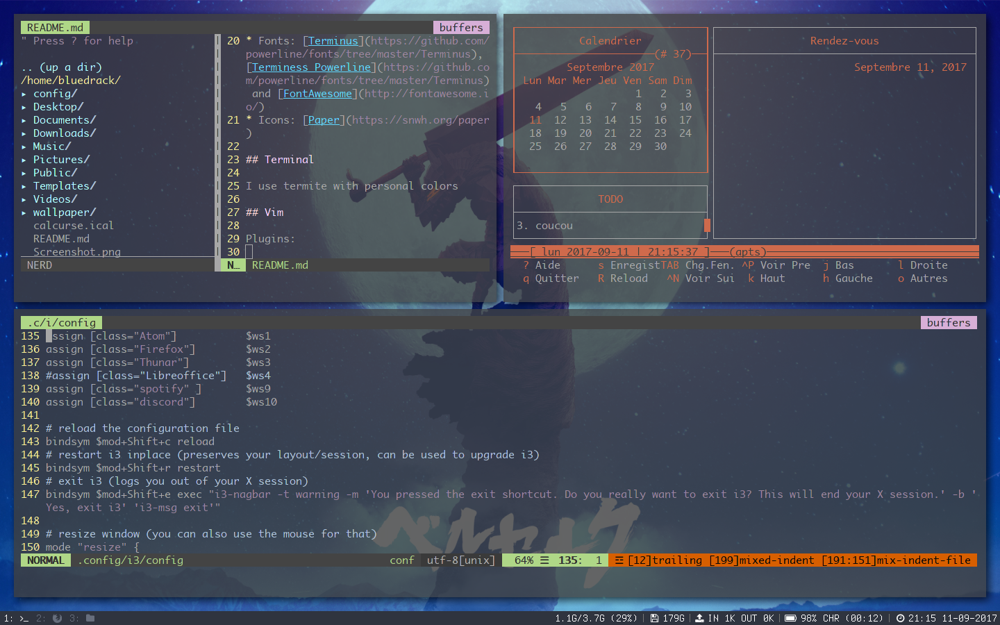

# My personal config for i3

This config is based on [i3-gaps](https://github.com/Airblader/i3)

And some other tool :

* [Rofi](https://davedavenport.github.io/rofi/)
* [i3-blocks](https://github.com/Airblader/i3blocks-gaps)
* [powerline](https://github.com/powerline/powerline)

## My desktop

My current desktop 

## Themes

* Windows: [Arc-Dark](https://github.com/horst3180/arc-theme)
* Firefox: [Arc-Dark](https://github.com/horst3180/arc-firefox-theme)

## More infos

I use also some useful tools  	
	
* [Cmus](https://cmus.github.io/) or Spotify for my music
* [Ranger](http://ranger.nongnu.org/) as a console file manager	 
